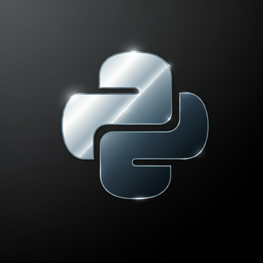
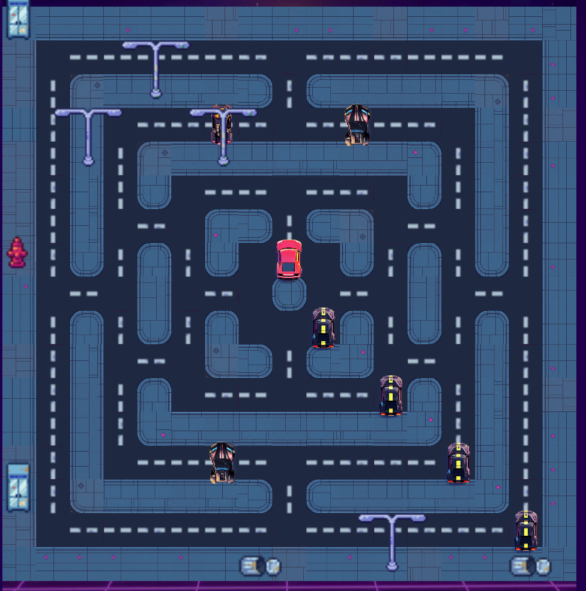

# Blitz 2025 Registration - /dev/null  
It's this time of year again -- time to put an unnecessary amount of time and overkill in a Coveo Blitz registration challenge.

Now don't worry; this year there's no need to [reverse engineer V8 assembly to predict randomness](https://github.com/JesseEmond/blitz-2024-registration/tree/main) (2024), [simulate ants](https://github.com/JesseEmond/blitz-2023-inscription) (2023), or play [Tetris on steroids](https://github.com/JesseEmond/blitz-2022-inscription) (2022) -- this year we're playing with **Hot Wheels Pacman**.

... I *might* be lying. There *might* have been some assembly involved this year, too. I can't help it. *BUT HEY* we ended up with the theoretically maximum, **10,005 points, on all possible maps**!

That makes it all worth it, right?

*... right?*
## The Challenge  
We're essentially roleplaying this movie, but with cars:


_We get to be Leonardo DiCaprio, while Coveo HR is Tom Hanks._

But the game really looks like this:

Our car is the red one (objectively the fastest color), and we are told that Coveo HR is trying to catch us with all those other cars because we forgot to complete our timesheet last quarter, and we want to avoid them for as long as possible (... _what is happening in Coveo offices!?_).

We're presented with a turn-based game.

Each **turn**, our bot must pick an action: move **up**, **down**, **left**, or **right** (or "move to position", and Coveo gracefully does the pathfinding for us).

Our bot must pick its action each turn **within 100ms** based on the game state we receive from the server, which notably contains information about each **threat**:
- Position & direction;
- "Personality" (what's that?)
- "Style" (what's that?)

Our bot gets scored by how many ticks it survived (1 tick is worth 5 points). There is a maximum of 2,000 ticks per game. Thus, the maximum possible score is **10k points** (in reality, as you'll see: 10,005 points).

... And that's pretty much all the info we get.

We can play a few games to find out the following as well:
- There's a couple of different maps;
- `style` can be a couple of different values:
	- `goldfish`
	- `bull`
	- `deer`
	- `shark`
	- `owl`
	- `hawk`
- `personality` seems to always be `lazy`, but maybe that can change...? (spoiler: it can);
- We can send an empty list of actions to stay still on a tick.

A game with an early bot AI might look like this (every movement of the red car is controlled by our bot):

https://github.com/user-attachments/assets/c14011a1-1bb2-4a88-8d99-4cc59fcba48c

In the game above, we survived for 256 ticks, worth **1,280 points**.
## Let's Start Simple
### Simple, but in Python  


_Python, but shiny._

We can kick off our Blitz journey with incremental improvements to a Python bot while we become more familiar with the challenge:
- Pick a random direction, but don't pick directions that have walls;
- Don't walk on top of a threat (note: but we don't know how threats move, so who knows!);
- Walk towards "safety", or spots that have a higher distance to any possible threat;
- When not immediately at risk (e.g. a threat with distance 2 near us), move towards the safest point on the map.

My memory is a bit fuzzy, but I think the example video I shared above was effectively doing this. It's not horrible, we can get a bit over 1,000 points with this!

But surely we can do better?
### Simple, but in Rust  


_"Python"._

First, why already rewrite in Rust? Couldn't we do a ton more to improve this bot?

Pragmatically, that's certainly the case. But I know myself; I know I'll try to push the challenge a bit and try to do a search for good moves and make use of our 100ms budget, and I'll be glad to not have the language become a crutch at some point in that process and to have invested early in the intended "final state". Plus, it's a good excuse to practice & learn Rust more!

To do this, a lot of our [2024 setup](https://github.com/JesseEmond/blitz-2024-registration/tree/main?tab=readme-ov-file) can be reused. We can make our Python code be a very thin bot that only calls into a real Rust implementation that does the real work. Call it "Python". For that, we can use [pyo3](https://pyo3.rs/v0.22.6/). See commit [`7aa519e`](https://github.com/JesseEmond/blitz-2025-registration/commit/7aa519e411554596e982e3ea84409f477dab1873) for an example of how to do that.

Once we're done recoding our bot in Rust, we can then start looking in the future a bit when considering a move. A simple approach is to pretend that enemy threats are all purely random, and sample their possible actions multiple times to get a probabilistic idea of how good a move is.

But presumably some threats are somewhat intelligent ("`shark`"? that can't be good for us), so we can go to the other extreme and instead start doing a [minimax](https://en.wikipedia.org/wiki/Minimax) search with some heuristic, pretending that enemies are *really* trying to give us a bad time. We can do this by using some heuristic like "threats are as far as possible to us", and also treat the game as if it was turn-based for enemies even (i.e. pretend that game turns are: player, enemy 1, enemy 2, enemy 3, enemy 4, player, enemy 1, ...). The search graph would then look like:


I started with that, with a search depth of 10.

But this is not ideal either, because the threats are probably not actively searching for our possible moves in the future like a game of chess, they likely have some set logic that we don't quite know about. So this will make a very pessimistic bot that thinks that threats will always get them soon, and be surprised when they don't really. 
Sometimes our bot will run into threats, even, because it assumes that regardless of what actions it takes, the threats will catch it in the next couple turns, so what does it matter if it's on turn 1 instead of 5? (some of this is because our heuristic should reward surviving longer, but still).

It's as if our bot thinks it's getting chased by this ungodly creature:

_All fear the Goldeerowl._

Wouldn't it be great if we didn't have to model the enemies as seers that can counter our every moves, and instead really understood how a `shark` or a `goldfish` thinks?
  
## Let's ~~Cheat~~ See the Future  
Faced with enemies with unknown logic, we could approach this in multiple ways:
- Make educated guesses for what the threat "styles" might mean ("owl", "shark", "bull", "deer", etc.) and play many games to test our theories;
- Treat this as a Reinforcement Learning problem, play many many offline games and learn useful patterns (e.g. using [Q-Learning](https://en.wikipedia.org/wiki/Q-learning));
- Craft heuristics that humans intuitively follow when playing a game like this;
- Replicate the server's logic exactly and treat this as a search problem;
- etc.

All these are valuable and would give very interesting bots that can perform well.

For me, I get the most fun from a Blitz challenge by trying to answer, assuming no time constraint, "what would an optimal bot do?", and do a mini version of that with the given time budget. This is why I wasted a bunch of time [trying to get Held-Karp to work for TSP](https://github.com/JesseEmond/blitz-2023-inscription?tab=readme-ov-file#%EF%B8%8F-exact-solver-held-karp), calculated [probabilities of perfect score when packing tetrominoes](https://github.com/JesseEmond/blitz-2022-inscription?tab=readme-ov-file#probability-of-a-perfect-score), and took a deep dive into reverse engineering last year's binary to [perfectly predict the server's random number generation](https://github.com/JesseEmond/blitz-2024-registration/tree/main?tab=readme-ov-file#rabbit-hole-2-nostradamus).

What would an optimal bot look like, here?

*Close your eyes.*

Imagine a bot that searches for the best sequence of moves by looking many moves ahead while knowing _exactly_ how the bots would react *(how are you reading this?)*

That would be nice, right? But that would mean that we'd have to perfectly replicate the server... and _that_ would mean that we need to reverse enginee-- oh.

Oh no.

Not again?
  
### Reading Assembly for Virtual Points in a Competition I Can't Participate In  

Similarly to [last year](https://github.com/JesseEmond/blitz-2024-registration/tree/main?tab=readme-ov-file#rabbit-hole-1-what-if-blitz-was-a-ctf), we're given a linux executable binary with the server's logic in it. All the answers to our questions are in it, we just have to work a little (alright, a lot) to get them.

If we were to open the binary in [Ghidra](https://ghidra-sre.org/), we'd have a bad time and it would look quite complex for the game we're dealing with. The reason for that is because the binary is not just a binary of the challenge, it's a *full NodeJS interpreter* binary!

Similar to last year, Coveo is packaging a NodeJS application using [vercel/pkg](https://github.com/vercel/pkg), and Vercel pkg works like this:
- Start from the source code of a NodeJS interpreter (C++);
- Apply patches to the NodeJS source to do the following:
	- Add all of the application's JS code (compiled to internal V8 bytecode) as a hardcoded string in the binary;
	- Change the *main* function to run a Vercel bootstrapping JS file that will pretend that operations like *import* are reading from the filesystem, when in reality they read from that hardcoded constant in the binary;

If you care about the details here, see [this section](https://github.com/JesseEmond/blitz-2024-registration/tree/main?tab=readme-ov-file#rabbit-hole-1-what-if-blitz-was-a-ctf) from last year.

But, thankfully, this year's application is packaged using the same NodeJS version, so we can even reuse our work from last year as-is and it works! We are able to recover the V8 assembly!

The trick is again this:
- Extract the serialized bytecode with [pkg-unpacker](https://github.com/LockBlock-dev/pkg-unpacker);
- Similar to how Vercel patches the C++ of the NodeJS interpreter to package a NodeJS application in it, we can _also_ patch the C++ to do our bidding.
- Here, our bidding involves using internal V8 functions to print disassembled code, right after loading it.
- Then, we use that binary to read the challenge's unpackaged serialized JS files to recover V8 assembly.

So, for a file like `ation_types.js` that defines the actions like go up, go down, etc., we'll get something like:
```
=== [0x2bb5c29a4db8] DISASSEMBLY ===
Parameter count 1
Register count 1
Frame size 8
OSR urgency: 0
Bytecode age: 0
    0 S> 0x2bb5c29a4db8 @    0 : 80 00 00 00       CreateClosure [0], [0], #0
         0x2bb5c29a4dbc @    4 : c4                Star0 
  398 S> 0x2bb5c29a4dbd @    5 : a9                Return 
Constant pool (size = 1)
0x2bb5c29a4dc1: [FixedArray] in OldSpace
 - map: 0x3ccb09b012e1 <Map>
 - length: 1
           0: 0x2bb5c29a4dd9 <SharedFunctionInfo>
Handler Table (size = 0)
Source Position Table (size = 7)
0x2bb5c29a52e1 <ByteArray[7]>
0x2bb5c29a4dd9 points to: [0x2bb5c29a4e48]
=== [0x2bb5c29a4e48] DISASSEMBLY ===
Parameter count 6
Register count 6
Frame size 48
OSR urgency: 0
Bytecode age: 0
   10 E> 0x2bb5c29a4e48 @    0 : 83 00 01          CreateFunctionContext [0], [1]
         0x2bb5c29a4e4b @    3 : 1a fa             PushContext r0
   76 S> 0x2bb5c29a4e4d @    5 : 21 01 00          LdaGlobal [1], [0]
         0x2bb5c29a4e50 @    8 : c2                Star2 
   83 E> 0x2bb5c29a4e51 @    9 : 2d f8 02 02       GetNamedProperty r2, [2], [2]
         0x2bb5c29a4e55 @   13 : c3                Star1 
         0x2bb5c29a4e56 @   14 : 13 03             LdaConstant [3]
         0x2bb5c29a4e58 @   16 : c0                Star4 
   98 E> 0x2bb5c29a4e59 @   17 : 7c 04 04 29       CreateObjectLiteral [4], [4], #41
         0x2bb5c29a4e5d @   21 : bf                Star5 
         0x2bb5c29a4e5e @   22 : 19 03 f7          Mov a0, r3
   83 E> 0x2bb5c29a4e61 @   25 : 5c f9 f8 04 05    CallProperty r1, r2-r5, [5]
  139 S> 0x2bb5c29a4e66 @   30 : 0e                LdaUndefined 
  158 E> 0x2bb5c29a4e67 @   31 : 32 03 05 07       SetNamedProperty a0, [5], [7]
  190 S> 0x2bb5c29a4e6b @   35 : 13 06             LdaConstant [6]
         0x2bb5c29a4e6d @   37 : c2                Star2 
  190 E> 0x2bb5c29a4e6e @   38 : 62 04 f8 09       CallUndefinedReceiver1 a1, r2, [9]
  190 E> 0x2bb5c29a4e72 @   42 : 25 02             StaCurrentContextSlot [2]
  229 S> 0x2bb5c29a4e74 @   44 : 21 01 00          LdaGlobal [1], [0]
         0x2bb5c29a4e77 @   47 : c2                Star2 
  236 E> 0x2bb5c29a4e78 @   48 : 2d f8 02 02       GetNamedProperty r2, [2], [2]
         0x2bb5c29a4e7c @   52 : c3                Star1 
         0x2bb5c29a4e7d @   53 : 13 05             LdaConstant [5]
         0x2bb5c29a4e7f @   55 : c0                Star4 
  251 E> 0x2bb5c29a4e80 @   56 : 7c 07 0b 29       CreateObjectLiteral [7], [11], #41

[... 64 more lines of this]
```
If you want to explore this, look at [this directory](https://github.com/JesseEmond/blitz-2025-registration/tree/main/disassembled_js/490a918d96484178d4b23d814405ac87) and read files that end in `.disass.js` (example: [`action_types.disass.js`](https://github.com/JesseEmond/blitz-2025-registration/blob/main/disassembled_js/490a918d96484178d4b23d814405ac87/challenge/actions/action_types.disass.js)).

If we were to write this as JS-like code, it might look like:
```js
function func_unknown()
{
    r0 = func_unknown_00000251A459DD69
    return func_unknown_00000251A459DD69
}
function func_unknown_00000251A459DD69(a0, a1, a2, a3, a4)
{
    r1 = Scope[0]
    Scope[1][2] = null
    Scope[1][3] = null
    r6 = new {"value": true}
    r4 = a0
    ACCU = "Object"["defineProperty"](r4, "__esModule", r6)
    a0["ActionFactory"] = func_ActionFactory_00000251A459DF19
    Scope[1][2] = a1("../geometry/vector")
    Scope[1][3] = a1("./action_types")
    return undefined
}
function func_ActionFactory_00000251A459DF19(a0)
{
    if (!typeof(a0["type"]) == string)
    	|| (a0["type"]["length"] === 0)
    {
        r1 = ("invalid action type" + String(a0["type"]))
        ACCU = "Error"
        ACCU = "Error"(r1)
    }
    switch ()
    case a0["type"] === Scope[1][3]["ActionType"]["MOVE_LEFT"]:
    {
        r1 = new {"type": null}
        r1["type"] = Scope[1][3]["ActionType"]["MOVE_LEFT"]
        return r1
    }
    case a0["type"] === Scope[1][3]["ActionType"]["MOVE_RIGHT"]:
    {
        r1 = new {"type": null}
        r1["type"] = Scope[1][3]["ActionType"]["MOVE_RIGHT"]
        return r1
    }
    case a0["type"] === Scope[1][3]["ActionType"]["MOVE_UP"]:
    {
        r1 = new {"type": null}
        r1["type"] = Scope[1][3]["ActionType"]["MOVE_UP"]
        return r1
    }
    case a0["type"] === Scope[1][3]["ActionType"]["MOVE_DOWN"]:
    {
        r1 = new {"type": null}
        r1["type"] = Scope[1][3]["ActionType"]["MOVE_DOWN"]
        return r1
    }
    case a0["type"] === Scope[1][3]["ActionType"]["MOVE_TO"]:
    {
        r1 = new {"type": null, "position": null}
        r1["type"] = Scope[1][3]["ActionType"]["MOVE_TO"]
        r1["position"] = Scope[1][2]["Vector"]["fromPosition"](a0["position"])
        return r1
    }
    default:
    {}
    r2 = ("invalid action type" + String(a0["type"]))
    ACCU = "Error"
    ACCU = "Error"(r2)
}
```

And, just like last year, this still looks a bit weird (e.g. `__esModule`...?) in part because **Coveo Devs are using TypeScript**. In other words, we're staring at V8 assembly that was compiled from JavaScript, which was transpiled from TypeScript, and trying to figure out what's going on.

You can visualize it like this:


However, this year this was a _lot_ easier to work with. [willtrnr](https://github.com/willtrnr) came to the rescue (**huge thank you**) and shared shiny new tooling that exists since ~july 2024: [View8](https://github.com/suleram/View8). This is a static analysis tool to decompile serialized V8 bytecode (yay!), using a patched compile V8 binary. You can read [this blog post](https://research.checkpoint.com/2024/exploring-compiled-v8-javascript-usage-in-malware/ ) to learn more about it.

What's interesting is that it approaches it very similarly to what was described so far -- it patches a NodeJS binary (see the available versions on [this page](https://github.com/suleram/View8/releases)) to produce disassembled V8 assembly. Then, it goes a step further to parse, translate, and simplify this assembly to produce much more readable JS-like code. See [translate_table.py](https://github.com/suleram/View8/blob/main/Translate/translate_table.py) for some example translations of the assembly. This is neat!

It's also cool to see that our extremely hacky approach is not too far off from the approach taken here, but unfortunately their custom patch to NodeJS code (which I really would have liked to see, to see how to do this more cleanly) isn't published, they just released specific exes of patched versions. For that reason as well, Will had to go through a fair amount of tinkering to get this working with Coveo's binary.

All this to say: instead of parsing V8 assembly, we can look at semi-decompiled JS in files `.decomp.js`. If you want to "read the server's code" (well, decompiled JS from the final V8), look for these files in [this same directory](https://github.com/JesseEmond/blitz-2025-registration/tree/main/disassembled_js/490a918d96484178d4b23d814405ac87).

Finally, there is still value in improving the workflow of this tooling moving forward. vercel/pkg is now [archived and deprecated](https://github.com/vercel/pkg/commit/9066ceeb391d9c7ba6aba650109c2fa3f8e088eb) because NodeJS now supports [single executable applications](https://nodejs.org/api/single-executable-applications.html). However, if we look into how this works, it's still storing a [V8 code cache](https://nodejs.org/api/single-executable-applications.html#v8-code-cache-support), but stored using a different [packaging mechanism](https://github.com/nodejs/postject).
### Recovering The Server's Code (or not, idk we have assembly)  
To help replicate the server's logic, we can play a bunch of local games, while storing per-tick information of each game (by adding a `SAVE_JSONL_PATH`  utility option to our [application.py](https://github.com/JesseEmond/blitz-2025-registration/blob/2e6f363634f82a3e217d91827e0292cd93d24a6c/bot/application.py#L26)). Then, we can replay the game with a custom [replayer.py](https://github.com/JesseEmond/blitz-2025-registration/blob/main/bot/replayer.py) utility that runs one tick at a time, offline.

This is super helpful to check assertions of whether we accurately simulate the game. We can start with verifying a subset of the game's state with a few assertions (e.g. counting the ticks right, player position accurate, ...), and gradually expand the assertions until we can fully predict everything from the reverse engineered code (in other words, if the simulation is wrong, we misinterpreted the reverse engineered code in some way).

Now, I'm lying a bit, because I initially was running games with a local server each time and would wait to see an assertion break. But this quickly became slow & painful to reliably debug failures. Switching to this standalone and deterministic bank of game replays allowed much faster iteration.

I won't go into the details of the server and the exact same code because:
1) We don't have access to the real code, we just have our reinterpretation of it;
2) A lot of it is not necessarily worth calling out for the purposes of writing a bot.
I will mostly provide pointers to the decompiled code for folks that might be interested, and will provide python-like pseudocode/highlights at times.

Let's restate our objective: we want to perfectly replicate the server simulation logic, to be able to simulate and perfectly predict the threats when picking a move. Let's then focus on:
- Overall structure of a tick;
- Common logic to all threats;
- Per-type threat logic;
- Map loading.
#### Per-Tick Structure  
The server, on each tick, does the following:  
```js 
function playOneTick(tick) {
	this.currentTickNumber = tick;
	if (this.isGameComplete()) {  // player is dead / tick 2000 reached?
		let results = this.getGameResults();
		console.log("Your score is:" + results.score);
		return { gameComplete: true, gameResults: { results: results } };
	}
	if (tick > 0) {
		await this.fetchAndApplyPlayerCommands();
	}
	this.updateGame();  // This updates the threats
	return {
		gameComplete: false,
		gameState: this.serializeForViewer(),
		errorsPerTeam: Object.fromEntries(this.lastTickErrors().entries()),
	};
}
```  

Essentially:
- Check for game over;
- Apply player action;
- Update threats.
  
#### Common Threat Logic  
Now, before going into the logic of each threat, it's helpful to describe a few utility classes and methods that are available and will be used in the per-threat logic.  
  
##### Random Number Generation  
Each threat [stores](https://github.com/JesseEmond/blitz-2025-registration/blob/a179249c7b6a6c618dab7975739a3f4ee013114f/disassembled_js/490a918d96484178d4b23d814405ac87/challenge/threats/threat.decomp.js#L448) an internal seed that starts at `0`. Every time a new number is generated, that seed is incremented. You'll see that the random number generation is a bit unique, and honestly I'm not sure how feasible it would be to clone the server's logic if we weren't reversing the assembly here!  
```js
class Threat {
	constructor(/*...*/) {
		// [...]
		this._seed = 0;
		// [...]
	}
	randomNumber() {
		let x = Math.sin(this._seed++) * 10000;
		return x - Math.floor(x);
	}
}
```  
([source](https://github.com/JesseEmond/blitz-2025-registration/blob/a179249c7b6a6c618dab7975739a3f4ee013114f/disassembled_js/490a918d96484178d4b23d814405ac87/challenge/threats/threat.decomp.js#L411-L418))
  
Note that the above, if used for all RNG purposes, gives perfect per-threat determinism! This means that we don't have to guess or recover an initial seed to clone the game -- we already know it (`0`).

As a side note, it's worth being aware of the limits of a custom random number generation algorithm like this. This algorithm is described on [this stackoverflow post](https://stackoverflow.com/questions/521295/seeding-the-random-number-generator-in-javascript/19303725#19303725), where we can find that someone [plotted the bias](https://jsfiddle.net/bhrLT/17/) of this RNG towards 0.0 and 1.0. Also, shouldn't the seed start at `1`, like in the example? (We'll revisit this later)
  
##### Possible Directions  
A couple threats will consider "what are my possible directions" when making choices. The [decompiled code](https://github.com/JesseEmond/blitz-2025-registration/blob/a179249c7b6a6c618dab7975739a3f4ee013114f/disassembled_js/490a918d96484178d4b23d814405ac87/challenge/threats/threat.decomp.js#L123-L228) for it is a bit verbose, but the important bits are:
- It will only return directions where there is no wall;
- It will process the directions in the order `[left, right, up, down]`.

The latter is important to match the server's logic exactly.

The code is equivalent to something like:
```js
class Threat {
	// ...
	getPossibleDirections() {
		return ["left", "right", "up", "down"].filter(function(dir) {
			// movement in x/y space
			let dx = dir == "left" ? -1 : (dir == "right" ? +1 : 0);
			let dy = dir == "up" ? -1 : (dir == "down" ? +1 : 0);
			// position after move
			let x = this._position.x + dx;
			let y = this._position.y + dy;
			return x >= 0 && x < this._map.length &&  // x inbounds
				y >= 0 && y < this._map[x].length &&  // y inbounds
				this._map[x][y] == MAP_EMPTY;  // not a wall
		});
	}
}
```
##### Move Ticks  
Challenge participants might have noticed that threats don't move on every tick. But, when they move, they all move at the same time. Furthermore, at a certain point they all speed up at the same time, along with a "personality" change.

[This](https://github.com/JesseEmond/blitz-2025-registration/blob/a179249c7b6a6c618dab7975739a3f4ee013114f/disassembled_js/490a918d96484178d4b23d814405ac87/challenge/threats/threat.decomp.js#L53-L90) is why:
```js
class Threat {
	constructor(/*...*/) {
		// ...
		this.personality = "lazy";
		this.tickSpeedMap = { lazy: 5, tease: 4, awake: 3, hungry: 2, insane: 1 };
	}
	// ...
	update(state) {
		if (state.tick > 900) { 
			this.personality = "insane";
		} else if (state.tick > 700) {
			this.personality = "hungry";
		} else if (state.tick > 500) {
			this.personality = "awake";
		} else if (state.tick > 300) {
			this.personality = "tease";
		}
		++this.nbOfTicksSinceLastMove;
		if (this.nbOfTicksSinceLastMove >= this.tickSpeedMap[this.personality]) {
			this.nbOfTicksSinceLastMove = 0;
			this.move(state);
		}
	}
}
```  
([update source](https://github.com/JesseEmond/blitz-2025-registration/blob/a179249c7b6a6c618dab7975739a3f4ee013114f/disassembled_js/490a918d96484178d4b23d814405ac87/challenge/threats/threat.decomp.js#L53-L90), [ctor source](https://github.com/JesseEmond/blitz-2025-registration/blob/a179249c7b6a6c618dab7975739a3f4ee013114f/disassembled_js/490a918d96484178d4b23d814405ac87/challenge/threats/threat.decomp.js#L441-L450))

In other words, threats start by moving every 5 ticks, then after 301 ticks they move every 4 ticks, then after 501 ticks they move every 3 ticks, until 901 ticks where they start moving every tick. This is interesting, because we might expect that surviving >900 ticks is not that far from surviving up to the maximum of 2000 ticks (in practice, it's not that simple).
##### Pathfinding  
The game has utils with pathfinding logic. We'll see that not all threats rely on this for pathfinding, but it appears in a couple of places.

I won't copy [the code](https://github.com/JesseEmond/blitz-2025-registration/blob/main/disassembled_js/490a918d96484178d4b23d814405ac87/challenge/utils/pathfinding.decomp.js) here because it's a non-trivial amount, but it computes, for every possible starting square, the shortest distance to every other square on the grid. Let me use this as a chance to plug [Amit's A-Star pages](https://www.redblobgames.com/pathfinding/a-star/introduction.html#breadth-first-search) for great pointers to really understand pathfinding algorithms and internalize how they work.
In terms of cloning this, the exact details of how closest distances are computed aren't that important to us, because the utils really only save the cost for every possible `(from, to)` pairs, they don't store a specific move sequence to reach each pair (in other words, the `came_from` mapping is not preserved).

Just know that the code uses a `internalGetDistances(from)` method that will return costs to other possible `to` positions, and that instead of returning a grid of positions, it encodes 2D positions as an integer with `width * y + x`.

We really care about how `getPath` works, since the threats use this to pick their next move (i.e. to move to the next cell on the path). It works like the following:
```js
class PathfindingGrid {
	internalGetDistances(from) { /* ... */ }
	isPositionValid(pos) { /* ... */ }
	getPath(from, to) {
		// ... some validation checks
		// Find distances to our target 'to'.
		let distances = this.internalGetDistances(to);
		let path = [];
		// Start with the known total 'dist', keep picking the next
		// neighbor that brings us to 'dist-1'.
		let dist = distances[from.y * this._width + from.x];
		let current = from;
		while (!current.equals(to)) {
			current = this.getNeighbors(current).find(
				(pos) => distances[pos.y * this._width + pos.x] == dist - 1);
			path.push(current);
			--dist;
		}
		return path;
	}
	getNeighbors(pos) {
		return [new Vector(pos.x - 1, pos.y),
		 new Vector(pos.x + 1, pos.y),
		 new Vector(pos.x, pos.y - 1),
		 new Vector(pos.x, pos.y + 1)].filter(
			 (p) => this.isPositionValid(p) && this._grid[p.x][p.y] === 0);
	}
}
```

I included the implementation of `getNeighbors` above, because that's effectively all we need to clone the server's logic -- to pick the next neighbor in the `left, right, up, down` order that brings us closer to `to`.

##### Spawning Orientation  
When a threat is created, it generates its orientation [randomly](https://github.com/JesseEmond/blitz-2025-registration/blob/a179249c7b6a6c618dab7975739a3f4ee013114f/disassembled_js/490a918d96484178d4b23d814405ac87/challenge/threats/threat.decomp.js#L381-L401):
```js
class Threat {
	constructor(/*...*/) {
		this._seed = 0;
		// ...
		this._direction = this.getRandomDirection();
	}
	getRandomDirection(except) {
		// Optionally support directions to avoid, but note not used here.
		let except = except || [];
		let options = ["up", "down", "left", "right"].filter(
			(dir) => !except.includes(dir));
		return options[Math.floor(this.randomNumber() * options.length)];
	}
}
```

I highlight this for a couple of reasons:
- This call to `randomNumber` will increment the seed, and we want to clone the server's RNG correctly, so we need to clone this to really start our `_seed` at 1;
- The logic of some threats relies on orientation, so replicating this matters;

But also, recall that `randomNumber()` does `Math.sin(seed) * 10000`, and `sin(0)` is, well, `0`. So the first `randomNumber()` **will always be exactly 0**! We can see this by noticing that **all threats start the game looking `up`** (first element in the list):


This might be deliberate and is really not a big deal -- even if it was seed `424242` they would all have the same orientation from generating the same first random number to index in an array of length 4 anyway, but I thought it was worth calling out the first-is-always-`0.000000...` to be aware of the implications of using a custom random number generator. :)

#### Threats Logic  
Now let's reimplement each threat, one at a time. The order I list them in matches the order I implemented them in, based on what looked easier to understand & clone from a glance at the decompiled JS.

It is funny that we get a peek into the internal names for each threat here, with a special mention for `tse_le_fantome_orange_dans_pacman.js`!
  
##### Goldfish (aka girouette)  
This one's really the simplest. It wanders aimlessly in the world without a specific goal (✨ relatable ✨).  
  
It picks its next move on each tick fully randomly from its available destinations: 
```js
class GirouetteThreat extends Threat {  // AKA Goldfish
	get_next_move() {
		let options = this.getPossibleDirections();
		return options[Math.floor(this.randomNumber() * options.length)];
	}
}
```
([decompiled JS](https://github.com/JesseEmond/blitz-2025-registration/blob/main/disassembled_js/490a918d96484178d4b23d814405ac87/challenge/threats/girouette.decomp.js), [Rust re-implementation](https://github.com/JesseEmond/blitz-2025-registration/blob/a179249c7b6a6c618dab7975739a3f4ee013114f/bot/src/simulation.rs#L108-L112))
  
##### Bull (aka straight_ahead)  
This one's also simple. If it can keep moving in the direction it is facing (if the `direction` of the threat is in `getPossibleDirections()`), it will do so.  
If it can't, it will pick a random direction like the Goldfish does:  
```js
class StraightAheadThreat extends Threat {
	get_next_move() {
		let options = this.getPossibleDirections();
		if (options.find((dir) => dir == this.direction)) {
			return this.direction;
		} else {
			return options[Math.floor(this.randomNumber() * options.length)];
		}
	}
}
```  
([decompiled JS](https://github.com/JesseEmond/blitz-2025-registration/blob/main/disassembled_js/490a918d96484178d4b23d814405ac87/challenge/threats/straight_ahead_threat.decomp.js), [Rust re-implementation](https://github.com/JesseEmond/blitz-2025-registration/blob/a179249c7b6a6c618dab7975739a3f4ee013114f/bot/src/simulation.rs#L115-L124))
##### Deer (aka tse_le_fantome_orange_dans_pacman)  
This one's a bit funny. Like the internal name implies, this is "y'know, like the orange ghost in Pacman". If we read on [the pacman orange ghost Clyde](https://gameinternals.com/understanding-pac-man-ghost-behavior), we learn that it will chase Pacman when they're far apart, but will change its mind once it gets close. Here, the deer will chase us when we're far, and go back to its spawn point when we're too close.

See it as: go near player, BUT NOT THAT CLOSE.

It will check how far it is from the player, via Euclidean distance, to pick its "target":  
- If the distance is <= 6 (player is "close"), target its own spawn point;  
- Else (player is "far"), target the player.  

Then, it will consider its possible directions (`getPossibleDirections()`):  
- If only one is possible, it will just pick that one.  
- Else, it will only consider positions that are not "behind" it, and pick the one that reduces its Euclidean distance to its target the most.  
- For equivalent options (same distance to target), it will favor the order returned by `getPossibleDirections()` (this is because modern JS Array sort is now stable (it wasn't before!?) -- our packaged NodeJS has version v18.5.0, which uses V8 version v10.2.154.4, and V8 has (only!?) had stable sort [since v7.0](https://v8.dev/blog/array-sort)).  
  
In code:  
```js
class LeFantomeOrangeDansPacmanThreat extends Threat {
	get_next_move() {
		let options = this.getPossibleDirections();
		if (options.length === 1) {
			return options[0];
		}
		// Don't go "backwards", based on our current direction.
		let options = options.filter(
			(dir) => dir != this.oppositeDirections[this.direction]);
		let dist = this.getSquaredDistance(this.position, this.characterPosition);
		// Far away from player? Chase them. Close? Go back to spawn.
		let target = dist > (6 * 6)) ? this.characterPosition : this.spawnPosition;
		options.sort(function(a, b) {
			let a_dist = this.getSquaredDistance(a, target);
			let b_dist = this.getSquaredDistance(b, target);
			return a_dist - b_dist;  // pick closest (smallest dist first)
		});
		return options[0];
	}
}
```  
([decompiled JS](https://github.com/JesseEmond/blitz-2025-registration/blob/main/disassembled_js/490a918d96484178d4b23d814405ac87/challenge/threats/tse_le_fantome_orange_dans_pacman.decomp.js), [Rust re-implementation](https://github.com/JesseEmond/blitz-2025-registration/blob/a179249c7b6a6c618dab7975739a3f4ee013114f/bot/src/simulation.rs#L127-L142))

##### Shark (aka aggressive)  
At a high level, this bot is pathfinding directly towards us. This means that whatever move we do, if we're not moving away from this bot, it inches closer and closer for the kill ([DUN-DUN DUN-DUN DUN-DUN 🦈](https://www.youtube.com/watch?v=ZvCI-gNK_y4)).  
  
But it's also an interesting one, because it uses its own pathfinding logic and does not use the pathfinding utils presented earlier. Crucially, it implements pathfinding in a unique way that can yield different paths from the utils version (but equivalent cost-wise). We care about this when cloning the server.
  
Let me summarize this with pseudo code here:
```python
def get_next_move():
	path = get_aggressive_path(game_map, from_pos, to_pos)
	return move_towards(path[0])  # Move in direction to follow path

def get_aggressive_path(game_map, from_pos, to_pos):
	all_empty_positions = []
	for x in range(game_map.width):
		for y in range(game_map.height):
			if game_map.is_empty(Pos(x, y)):
				all_empty_positions.append(Pos(x, y))
	cost = {p: Infinity for p in all_empty_positions}
	cost[from_pos] = 0
	came_from = {}
	unseen = all_empty_positions
	while unseen:
		unseen.sort(function(a, b) { cost[b] - cost[a]})
		pos = unseen.pop()
		prev_cost = cost[pos]
		new_cost = prev_cost + 1
		# Neighbors order: left, right, up, down
		for neighbor in game_map.get_neighbors(pos):
			if new_cost >= cost[neighbor]:
				continue
			cost[neighbor] = new_cost
			came_from[neighbor] = pos
	path = []
	current = to_pos
	while current != from_pos:
		path.insert(0, current)
		current = came_from[current]
```  
([decompiled JS](https://github.com/JesseEmond/blitz-2025-registration/blob/main/disassembled_js/490a918d96484178d4b23d814405ac87/challenge/threats/aggressive.decomp.js), [Rust re-implementation](https://github.com/JesseEmond/blitz-2025-registration/blob/a179249c7b6a6c618dab7975739a3f4ee013114f/bot/src/pathfinding.rs#L61-L122))

For all things pathfinding, I highly recommend (again) [Amit's pages](https://theory.stanford.edu/~amitp/GameProgramming/) as a resource, I'll be reusing some of the vocabulary from there. Overall, the above `get_aggressive_path` for pathfinding purposes works correctly, and looks fairly similar to a typical Dijkstra search.

What stands out, however, is the sort of all yet-unseen positions on each loop. The choice to sort the frontier queue every time a new node is picked is a costly one that can subtly impact the pathfinding outputs if not replicated. This is fine of course for a server that processes a single tick, but you'll see later that this is a challenge for us if we want to rapidly simulate the server many times in 100ms when searching for our next move.
  
##### Owl (aka surveillance)  
This one is a bit more funky (guessing the specifics without reverse engineering sounds... challenging):  
- When tick % 60 < 10, store the position of the player;  
- Pathfind towards the stored player position.  
  
Notably, this is now relying on the pathfinding utils.  
```js
class SurveillanceThreat extends Threat {
	get_next_move(state) {
		if (state.tick % 60 < 10) {
			this._lastTargetSeenPosition = state.character.position;
		}
		return this.getSurveillancePath(state);
	}
	getSurveillancePath(state) {
		// This is using the utils from above.
		let path = state.pathfindingGrid.getPath(
			this.position, this._lastTargetSeenPosition);
		// Move in the direction of the next tile
		let target = path[1];
		if (target) {
			if (target.position.x > this.position.x) return "right";
			if (target.position.x < this.position.x) return "left";
			if (target.position.y > this.position.y) return "down";
			return "up";
		}
		return null;
	}
}
```  
([decompiled JS](https://github.com/JesseEmond/blitz-2025-registration/blob/main/disassembled_js/490a918d96484178d4b23d814405ac87/challenge/threats/surveillance.decomp.js), [Rust re-implementation](https://github.com/JesseEmond/blitz-2025-registration/blob/a179249c7b6a6c618dab7975739a3f4ee013114f/bot/src/simulation.rs#L149-L166))

##### Hawk (aka sheriff)  
This one is even funkier! Guessing the specifics without reverse engineering sounds... Well, infeasible; It does "line of sight" checks, has an idle state, remembers when the player was last seen, and has a concept of "best intersections". It has it all! It's effectively a state machine that switches between states that I'll call: **chasing**, **positioning**, or **idling**.
  
Let's break it down:  
- In any state, if the player is in the hawk's line of sight (same x or same y, no walls in between), go in **chasing** mode (remember that position as "last seen", set "idle rounds" to 0).  
- In **chasing mode**:  
	- Walk towards the "last seen" position (using pathfinding utils);  
	- Once reached, forget "last seen", set "idle rounds" to 0, and go in **idling** mode.  
- In **idling mode**:  
	- Increment "idle rounds";  
	- If "idle rounds" > 5, set "idle position" to a random "good intersection", set "idle rounds" to 0, and enter **positioning** mode;  
	- Else, do nothing.  
- In **positioning** mode:  
	- Walk towards the "idle position" (using pathfinding utils);  
	- Once reached, forget "idle position", set "idle rounds" to -5, and go in **idling** mode.  
  
In pseudo-code:  
```python
def get_next_move(self, state):
	if state.grid.is_player_in_direct_line_of_sign(self.position, state.player):
		self.target_last_seen = state.player  # Enter "chasing"
		self.idle_position = None
		self.idle_rounds = 0
	if self.target_last_seen:  # "chasing" mode
		if self.position == self.target_last_seen:
			self.target_last_seen = None  # Enter "idling"
			self.idle_rounds = 0
			return None
		else:
			path = state.grid.pathfinding.get_path(
				self.position, self.target_last_seen)
			return self.follow_path(path)
	elif self.idle_position:  # "positioning" mode
		if self.position == self.idle_position:
			self.idle_position = None  # Enter "idling"
			self.idle_rounds = -5
			return None
		else:
			path = state.grid.pathfinding.get_path(
				self.position, self.idle_position)
			return self.follow_path(path)
	else:  # "idling" mode
		self.idle_rounds += 1
		if self.idle_rounds > 5:
			self.idle_position = self.get_random_intersection(grid)
			self.idle_rounds = 0
		return None
```  
([decompiled JS](https://github.com/JesseEmond/blitz-2025-registration/blob/main/disassembled_js/490a918d96484178d4b23d814405ac87/challenge/threats/sheriff.disass.js), [Rust re-implementation](https://github.com/JesseEmond/blitz-2025-registration/blob/a179249c7b6a6c618dab7975739a3f4ee013114f/bot/src/simulation.rs#L169-L215))

I talked about random "good intersections", what's that all about? I invite you to experience the pleasure of reverse engineering it yourself: [V8 assembly](https://github.com/JesseEmond/blitz-2025-registration/blob/main/disassembled_js/490a918d96484178d4b23d814405ac87/challenge/threats/sheriff.disass.js).

Okay, V8 assembly is maybe a bit rough, here's pseudo-JS for you to reverse:
```js
function func_getRowLength_00000343ED31FC19(a0)
{
    r1 = a0["y"]
    r2 = 0
    r6 = (a0["y"] - 1)
    while (true)
    {
        if (!r6 >= 0) break
        r7 = this["_grid"]
        r7 = r7[r0]
        r7 = r7[r6]
        if (r7 === 1)
        {
            r2 = (r2 + 1)
            continue
        }
        break
        r6 = (r6 - 1)
    }
    r5 = (a0["y"] + 1)
    while (true)
    {
        r8 = this["_grid"]
        r8 = r8[r0]
        if (!r5 < r8["length"]) break
        r7 = this["_grid"]
        r7 = r7[r0]
        r7 = r7[r5]
        if (r7 === 1)
        {
            r2 = (r2 + 1)
            continue
        }
        break
        r5 = (r5 + 1)
    }
    r4 = (a0["x"] - 1)
    while (true)
    {
        if (!r4 >= 0) break
        r7 = this["_grid"]
        r7 = r7[r4]
        r7 = r7[r1]
        if (r7 === 1)
        {
            r2 = (r2 + 1)
            continue
        }
        break
        r4 = (r4 - 1)
    }
    r3 = (a0["x"] + 1)
    while (true)
    {
        r8 = this["_grid"]
        if (!r3 < r8["length"]) break
        r7 = this["_grid"]
        r7 = r7[r3]
        r7 = r7[r1]
        if (r7 === 1)
        {
            r2 = (r2 + 1)
            continue
        }
        break
        r3 = (r3 + 1)
    }
    return r2
}
function func_getIntersections_00000343ED31F769(a0)
{
    r0 = []
    r7 = 1
    r4 = 1
    r5 = 1
    while (true)
    {
        r8 = r4
        if (r5 == 1)
        {
            r5 = 0
        }
        else
        {
            r8 = (r8 + 1)
        }
        r6 = 1
        if (r8 < (a0["length"] - 1))
        {
            break
        }
        while (true)
        {
            if (!r6 == 1) continue
            r9 = 1
            r1 = 1
            r2 = 1
            while (true)
            {
                r10 = r1
                if (r2 == 1)
                {
                    r2 = 0
                }
                else
                {
                    r10 = (r10 + 1)
                }
                r3 = 1
                r14 = a0[r8]
                if (r10 < (r14["length"] - 1))
                {
                    continue
                }
                while (true)
                {
                    if (!r3 == 1) continue
                    r13 = a0[r8]
                    r13 = r13[r10]
                    if (!r13 === 1) continue
                    r14 = new [0, 0, 0, 0]
                    r15 = a0[(r8 - 1)]
                    r14[0] = r15[r10]
                    r15 = a0[(r8 + 1)]
                    r14[1] = r15[r10]
                    r15 = a0[r8]
                    r14[2] = r15[(r10 - 1)]
                    r15 = a0[r8]
                    r14[3] = r15[(r10 + 1)]
                    r11 = r14
                    r13 = r14["filter"](func_unknown_00000343ED31F9E9)
                    if (!r13["length"] >= 3) continue
                    ACCU = Scope[1][2]["Vector"]
                    r16 = r8
                    r17 = r10
                    r15 = Scope[1][2]["Vector"](r16, r17)
                    ACCU = r0["push"](r15)
                    r3 = 0
                    r1 = r10
                    ACCU = r1
                }
                if (!r3 == 1) continue
                continue
            }
            r6 = 0
            r4 = r8
            ACCU = r4
        }
        if (!r6 == 1) continue
        break
    }
    return r0
}
function func_unknown_00000343ED31F9E9(a0)
{
    return a0 === 1
}
function func_computeBestIntersection_00000343ED31F471(a0)
{
    r1 = Scope[1]
    Scope[2][2] = this
    r0 = Scope[2][2]["getIntersections"](a0)
    ACCU = r0["sort"](func_unknown_00000343ED31F5C9)
    return r0["slice"](0, 10)
}
function func_unknown_00000343ED31F5C9(a0, a1)
{
    r0 = Scope[2][2]["getRowLength"](a0)
    r1 = Scope[2][2]["getRowLength"](a1)
    return (r1 - r0)
}
function func_getRandomIntersection_00000343ED31F2D9()
{
    r0 = this["_bestIntersections"]
    r3 = this["randomNumber"]
    r4 = this["_bestIntersections"]
    r3 = (r3 * r4["length"])
    return r0["Math"["floor"](r3)]
}
```
([source](https://github.com/JesseEmond/blitz-2025-registration/blob/main/disassembled_js/490a918d96484178d4b23d814405ac87/challenge/threats/sheriff.decomp.js))

Alright I'll spare you -- here's what it does (or read [Rust](https://github.com/JesseEmond/blitz-2025-registration/blob/a179249c7b6a6c618dab7975739a3f4ee013114f/bot/src/grid.rs#L150-L170), if you prefer):
- List all the "intersection points", defined as positions that have at least 3 empty neighbors (i.e. not a corner tile or a corridor tile);
- Sort them (descending) by how many "visible tiles" (here `getRowLength`) can be seen up/down/left/right from that position without a wall in the way;
- Keep the top 10.

Intuitively, remember that our Sheriff here -- ahem, hawk -- chases players that it sees in a "line of sight" (no walls between direct horizontal or vertical line between player and the hawk). This intersections business strategically places the hawk at spots where it covers a lot of visible tiles.

#### Maps  
Our local version of the game has a `maps` folder, with 6 `challenge` maps in it. From running a couple of games on the server, we see that the server is running the same maps that we have locally.

To really replicate the server from tick 0, we want to load the maps just like the server is doing. This is not strictly necessary -- we can copy the state of the server that we receive on tick 0, but doing this enables us to do cool things like:
- Play full games in Rust without needing a server on the side (faster games when testing, or adding custom rules for fun);
- Easily run on all maps and gather statistics of how well our bot performs.

The game loading logic is [here](https://github.com/JesseEmond/blitz-2025-registration/blob/main/disassembled_js/490a918d96484178d4b23d814405ac87/challenge/maps/map_loader.decomp.js), but essentially it parses a super tiny PNG that looks like this:

where each pixel is a tile and each color maps to a specific entity type (a threat, a player spawn, a wall).

If you squint, you can kind of see that it's this one:


When we receive tick 0, we can check all the maps we know about and find out which one it is (& verify that we _do_ indeed know about all the maps shown to us on the server).
## Let's Plan Ahead
So by reimplementing the logic above in Rust we can copy the server now, yay! ... What then?
### "It's free ~~real estate~~ search space"
Recall that we start from a simple bot that does a search for possible moves by treating moves by threats as a fork in the search graph:

It's as if the game was made up of "turns", like: player, enemy 1, enemy 2, ... I started with this, with a search depth of 10 "turns" ahead.

But for threats that we know how to predict, we can skip the work of looking at all their possible moves and just pick the move we _know_ it will take. This is akin to getting a search depth "for free" when we encounter this threat type (well, not free, at a compute cost of simulating it). We effectively get to prune all the other branches.

Suppose in the image above that we have changed our bot to simulate "Enemy 2". We can prune its non-taken branches "for free":

It's almost as if that depth doesn't exist anymore (it's a "passthrough", really, except for the need to simulate it). So we can actually just treat it like that -- when doing a search, don't treat this as a depth in our search graph (and don't count towards our search depth budget of 10 turns).

Note that as we simulate more and more threat types, this extra "free depth" simulation compute cost becomes noticeable and we must reduce our search depth to keep it reasonable. We gradually end up with a "shallower" search to stay in the time budget, but we fully know what will happen when we explore a possibility (& are still looking at more of _our_ moves ahead -- less "turns" spent on enemies). Once we can fully simulate all enemies, we end up with a search on _only_ our moves.
### Going faster to search deeper
This also means that optimizing our simulation can really pay off -- we unblock budget to do a deeper search of more moves ahead.

Here I'll describe some of the optimizations I implemented (measuring them using [benchmarks](https://github.com/bheisler/criterion.rs) and finding optimization opportunities with [profiling](https://nnethercote.github.io/perf-book/profiling.html)), with relative speedups applied incrementally based on the previous item.

On some games the bot worked well, but as soon as there was a shark involved ("aggressive"), our bot would slow down to a crawl. So this is the one that required the most iterations on optimizations.

**`get_aggressive_path` optimizations**
- **60% relative speedup**: Instead of working with a 2D grid & positions, assign empty tiles a unique ID (quick lookup index in a 2D grid) and treat it as a smaller 1D array. Use this representation to easily replace `HashMap` for pathfinding `cost` and `came_from` as vectors [`c40df79`](https://github.com/JesseEmond/blitz-2025-registration/commit/c40df79659b0e837d5bbbf2e2b5e8ea0f48424c7);
- **96% relative speedup**: Avoid sorting the entire frontier on each loop iteration, while preserving the behavior of the JS implementation that sorts each time [`2710622`](https://github.com/JesseEmond/blitz-2025-registration/commit/27106223aae66a9a31c3afe42de1de9efa4d3724) -- will detail below;
- (when player is near) **93% relative speedup**: Early exit pathfinding when the target is found, relevant in real play when we're getting chased and the Shark gets closer and closer [`0d6de5f`](https://github.com/JesseEmond/blitz-2025-registration/commit/0d6de5f9049854b39488dfc745a66ec3a4db66ca)
- **50% speedup**: after refactor that creates a common interface for slow & fast pathfinding implementation, to unit test correctness of optimization ([`16ca111`](https://github.com/JesseEmond/blitz-2025-registration/commit/16ca1119677ebf5a3b3828f307385fb88a72975b)), speedup suspected due to removing `next_frontier` deque and just using the one frontier with simpler buffers ([`2af1797`](https://github.com/JesseEmond/blitz-2025-registration/commit/2af1797f9ae3b629776ac365fc3f454b6d017ea8)) -- will detail below;
- Precompute neighbors of each tiles on the first tick [`239c202`](https://github.com/JesseEmond/blitz-2025-registration/commit/239c202d6247371b42c3f6c96db8d22b3992426a);
- Precompute paths for all possible empty tile pairs [`4563896`](https://github.com/JesseEmond/blitz-2025-registration/commit/4563896952d6a4ad90f529803a7edd881a854591) -- use _aggressive_ pathfinding logic;
- Lookup precomputed paths [`ac7fddf`](https://github.com/JesseEmond/blitz-2025-registration/commit/ac7fddfb93a32774cd04728c55274aecb5e91aac);
- Lookup pathfinding moves [`627a99f`](https://github.com/JesseEmond/blitz-2025-registration/commit/627a99f8e81a80dc4a8dcc53a9f362809756ad60).

Something I did mid-way, but wish I did from the get go, was implement the optimized and the slower approach (the one matching the server's) using a shared interface of pathfinding internals. This allows verifying that optimizations are correct at every step of the pathfinding process (e.g. nodes are explored in the same order in the pathfinding search) in a unit test, and adding optimizations with trust in their correctness.

To do so, recall that the *aggressive* pathfinding looks like this (rewritten in terms of "empty tile index" instead of positions):
```python
def get_aggressive_path(game_map, from_tile, to_tile):
	all_empty_tiles = []
	for x in range(game_map.width):
		for y in range(game_map.height):
			if game_map.is_empty(Pos(x, y)):
				all_empty_tiles.append(game_map.get_tile_index(Pos(x, y)))
	cost = {p: Infinity for p in all_empty_tiles}
	cost[from_tile] = 0
	came_from = {}
	unseen = all_empty_tiles
	while unseen:
		unseen.sort(function(a, b) { cost[b] - cost[a]})
		node = unseen.pop()
		prev_cost = cost[node]
		new_cost = prev_cost + 1
		# Neighbors order: left, right, up, down
		for neighbor in game_map.get_neighbors(node):
			if new_cost >= cost[neighbor]:
				continue
			cost[neighbor] = new_cost
			came_from[neighbor] = node
	path = []
	current = to_tile
	while current != from_tile:
		path.insert(0, current)
		current = came_from[current]
```

We can write a more general interface for this:

```python
import math

Cost = float
Node = int
Path = list[Node]

@dataclass
def PathfinderState:
	"""State of pathfinding from a given start point."""
	# cost[node_idx], shortest distance from 'start' to a node.
	cost: list[Cost]
	# came_from[node_idx], parent node on a shortest path to a node.
	came_from: list[Node | None]
	# target position, if applicable, for optional early stopping.
	target: Node | None

	def get_path(self, to: Node) -> Path:
		"""Get path for going to 'to', from our start position."""
		# Note: 'start' will not be included in the path.
		current = to
		path = []
		while True:
			parent = self.came_from[current]
			if parent is not None:
				path.append(current)
				current = parent
			else:
				break
		path.reverse()
		return path

class Pathfinder:
	def next_node(self, state: PathfinderState) -> Node | None:
		"""Next node to explore in our search, if we should continue."""

	def queue(self, state: PathfinderState, node: Node, cost: Cost) -> None:
		"""Queue up a future node to visit."""

	def commit(self) -> None:
		"""Called when we are done visiting a node.

		No other calls to 'queue' will be made for the current node.
		"""

	def pathfind(self, grid, from_tile: Node, to_tile: Node) -> PathfinderState:
		state = PathfinderState(
			cost=[math.inf for _ in range(len(grid.empty_tiles()))],
			came_from=[None for _ in range(len(grid.empty_tiles()))],
			target=to_tile)
		self.queue(state, from_tile, cost=0)
		self.commit()
		while True:
			current = self.next_node(state)
			if current is None:
				break
			current_cost = state.cost[current]
			for next_node in grid.get_neighbors(current):
				prev_cost = state.cost[next_node]
				new_cost = current_cost + 1
				if new_cost < prev_cost:
					state.cost[next_node] = new_cost
					state.came_from[next_node] = current
					self.queue(state, next_node, new_cost)
			self.commit()
		return state
```

We can then implement the slower server-like version like this:
```python
class ServerLikeAggressivePathfinder(Pathfinder):
	def __init__(self, grid):
		self.unseen = list(range(len(grid.empty_tiles())))

	def next_node(self, state: PathfinderState) -> Node | None:
		self.unseen.sort(key=lambda n: state.cost[n], reverse=True)
		return self.unseen.pop() if self.unseen else None

	def queue(self, state: PathfinderState, node: Node, cost: Cost) -> None:
		pass  # Nothing to do -- next node is recomputed every time!

	def commit(self) -> None:
		pass  # Nothing to do
```

This sort every `next_node` is expensive. Instead, we can create an optimized version. We can verify its correctness by ensuring, in a unit test, that the server-like version and the optimized version return `next_node`s in the same order.

To optimize this pathfinding, we need to keep the following in mind:
- Sort in modern JS is stable;
- Sort is called at the start of the loop, so any newly queued same-cost nodes added in the same loop will keep their relative order from `empty_tiles` instead of being in the order seen;
- When performing pathfinding on a grid with uniform costs like this, we can simplify the representation and just keep track of the current frontier (all of the same cost), with a "next frontier" for nodes with frontier cost + 1.
```python
class OptimizedAggressivePathfinder(Pathfinder):
	def __init__(self, grid):
		self.frontier = []  # In Rust, this is a VecDeque
		self.frontier_cost = 0
		# See 'commit' for why we need to buffer our 'queue's before adding them.
		self.frontier_buffer = []
		self.next_frontier_buffer = []

	def next_node(self, state: PathfinderState) -> Node | None:
		if not self.frontier: return None
		node = self.frontier.pop()
		if node == state.target:  # Optimization: early exit
			return None
		if state.cost[node] > self.frontier_cost:
			self.frontier_cost += 1
			# Nodes we find to add to our frontier will now be 'frontier_cost' or
			# 'frontier_cost + 1'
		return node

	def queue(self, state, node: Node, cost: Cost) -> None:
		if cost == self.frontier_cost:
			 self.frontier_buffer.append(node)
		else:
			assert cost == self.frontier_cost + 1
			self.next_frontier_buffer.append(node)

	def commit(self) -> None:
		# Because the JS code only sorts on new 'while' iterations, multiple
		# positions discovered on the same iteration will keep their same
		# initial ordering in the 'unseen' array, which comes from the
		# 'empty_tiles' creation order (their index). We can sort by node index
		# to replicate this.
		self.frontier_buffer.sort()
		self.next_frontier_buffer.sort()
		# New additions move to the front. When the JS version sorts, all the
		# previously unseen positions are to the left of seen ones (from prev
		# Infinity cost value), and will preserve this relative order to existing
		# frontier items (from a stable sort).
		for n in reversed(self.frontier_buffer):
			self.frontier.insert(0, n)  # (imagine a VecDeque push_front)
		for n in reversed(self.next_frontier_buffer):
			self.frontier.insert(0, n)  # (imagine a VecDeque push_front)
		self.frontier_buffer.clear()
		self.next_frontier_buffer.clear()
```

You can find the Rust implementation [here](https://github.com/JesseEmond/blitz-2025-registration/blob/main/bot/src/pathfinding.rs).

With all of the above optimizations, I was able to run with a search depth of 8 (recall that this is a search 8 of _our moves_, so a net improvement over our previous 10 that also considered enemy moves!)

More importantly, with all this we're now able to run our search using perfectly predicted threats within the time budget!
### *You can do what!?*
And from locally testing this full-prediction bot came a great revelation: **you can jump over enemies!**

This is a very funny way to discover this capability (thanks... bot?), and not something I initially realized while reverse engineering. Sure enough, if you recall from earlier, we saw that the server does:
- Check for game over;
- Apply player action;
- Update threats.

If we move on the same tick that a threat next to us is moving, we'll move past each other without the server detecting it. Fun!

Without perfectly replicating the server, this is a risky move to try, but our bot is not afraid. It just _knows_ it can do it.

Let's run it on the server!
### It's Over 9000!
I kicked off a game. Our best score so far had been 1,280 points (256 ticks).

And... Bam, 5,550 points (1110 ticks)! Nice!

I kicked off another game and, lo and behold, **10,005 points**! That's the full 2000 ticks of survival, the max possible score for this challenge, just like that! Looks like our reversing wasn't all for nothing.

 Please queue [this guitar solo](https://youtu.be/0LwcvjNJTuM?si=858NQoxWb_We6gt8&t=288) as you watch this highlight moment of the game:

https://github.com/user-attachments/assets/2b0f552e-c8c5-4b0e-bf25-ef03a8459e83

The full game looks like this:

https://github.com/user-attachments/assets/cb1b17f5-9273-45a0-a9e1-bc4ebcebaf4f

## Let's Win, But Fully
... but this is on one map. Wouldn't we want a full win? The max possible score on all possible maps?
### Monte Carlo Search Grammar & Search
We'll need a better search. A "minimax" search (really a breadth first search now without our enemy modeling) of a fixed depth isn't cutting it.

I switched the search to a Monte Carlo Tree Search ([MCTS](https://en.wikipedia.org/wiki/Monte_Carlo_tree_search)), which will allow us to sample possible future fates for out bot in different branches of our search tree.

I recalled spending a good amount of time [tweaking MCTS](https://github.com/JesseEmond/blitz-2024-registration/tree/main?tab=readme-ov-file#mcts-tweaks) last year, so I wanted to go shopping for a fun spin on it this time. In that process I found this interesting paper: [Monte Carlo Search Algorithm Discovery for One Player Games](https://arxiv.org/pdf/1208.4692).

The idea is quite fun: define a "grammar" over Monte Carlo Search algorithms, with the following components in the grammar:
- _Simulate_: apply an action policy repeatedly from a given state until the end of the game;
- _Repeat_: repeat a given subcomponent a fixed amount of times;
- _LookAhead_: for each legal move from our state, run a subcomponent starting from the successor state;
- _Step_: run step-by-step a given state, picking the next best action found by a subcomponent until the game ends;
- _Select_: (main component of a MCTS) maintain a game tree with nodes that have statistics on subcomponent outcomes. It: selects the next node to explore, calls a subcomponent from there, then backpropagates statistics.

With the above grammar, we can describe a couple of known algorithms:
- _random sampling_ (sample random paths over & over): `rs = simulate(random_policy)`;
- _iterative sampling_ (sample random paths, pick next move, repeat): `is = step(repeat(N, simulate(random_policy)))`;
- _mcts_: `mcts(selection_policy, simulation_policy, N) = step(repeat(N, select(selection_policy, simulate(simulation_policy))))`;
- (... many MCTS variants, see the paper for more)

The idea is that we can then perform a search over this grammar (paired with hyperparameter search from possible policies like greedy or random and parameters like `N`) to find a search tailored to our problem, or even find a new Monte Carlo Search based algorithm that's more appropriate.

I'm skipping a lot of details, but the paper is worth a closer read if you're interested.

I started by setting up the interfaces and just using random sampling for now. This gave decent results. Then, I started implementing other components in the paper, trying to beat random sampling, but it was hard to tell if my MCTS version was really better (which I intuitively expected it to be -- spending some compute time picking which action we should explore next, thus spending less time collecting samples than random sampling, but hopefully more promising ones).
### Iterate & Measure  
How do we compare two bots?

This took me on a tangent trying to remember my stats classes, and stumbling on this great series from [this blog](https://bytepawn.com/tag/ab-testing.html) on how A/B testing metrics get computed to measure statistical significance of metrics between treatment and control groups in software changes, which I'd recommend checking out. Special mention to [this one](https://bytepawn.com/ab-tests-moving-fast-vs-being-sure.html#ab-tests-moving-fast-vs-being-sure), which brings the idea of accepting the risk of more false-positives (higher p-value threshold) in a fast startup context.

But let's get back to business. We are reminded of our stats class, p-values, and that we might want a [sign test](https://en.wikipedia.org/wiki/Sign_test) of wins/ties/losses between two bots. I added that through a "battle" mode to our local Rust game simulator, with per-map and overall statistics. Add some parallelism to that to run many games in parallel and collect a bunch of samples to get statistically significant results.

This helped show that random sampling was definitely better than MCTS. That's odd. Intuitively, a "smarter" search like MCTS should really do better for this game (a bit more lookahead to avoid getting stuck somewhere), instead of just rolling the dice a couple more times per tick.
### Tuning MCTS anyway
This took up a good amount of time, but a bunch of fixes were needed to get this working:
- Many fixes to my implementation of the paper's search components (in particular around the unspecified details of how `invoke` exactly deals with the best-so-far sequence, and how search components use it);
- Search speedups (precompute all pathfinding pairs, precompute moves for pathfinding pairs);
- Scale MCTS rewards to 0-1 (using historical lowest/highest);
- Use greedy policy instead of random rollouts;
- Use "is not dead" heuristic (duh!), but notably doing an early "is it game over on the next tick" that the server would not normally do right away;
- Remember "best sequence seen so far" across ticks, so that the search does not start from scratch each time.

With all this, I was finally able to get a win of MCTS over sampling search! Here's the output from our battle tool, from [`3b2ac8b`](https://github.com/JesseEmond/blitz-2025-registration/commit/3b2ac8b70c29377a67e59d9876dcadda5fbd0aee) on all maps -- a clear victory:
```
[challenge1]:
0 Sampling wins, 6 ties, 19 Uct100RolloutsSqrt2CGreedyNotDead wins
Uct100RolloutsSqrt2CGreedyNotDead better than Sampling (p-value=0.000) 

[challenge2]:
0 Sampling wins, 25 ties, 0 Uct100RolloutsSqrt2CGreedyNotDead wins
not significant (p-value=1.000)

[challenge3]:
0 Sampling wins, 21 ties, 4 Uct100RolloutsSqrt2CGreedyNotDead wins
not significant (p-value=0.125)

[challenge4]:
0 Sampling wins, 21 ties, 4 Uct100RolloutsSqrt2CGreedyNotDead wins
not significant (p-value=0.125)

[challenge5]:
0 Sampling wins, 12 ties, 13 Uct100RolloutsSqrt2CGreedyNotDead wins
Uct100RolloutsSqrt2CGreedyNotDead better than Sampling (p-value=0.000)

[challenge6]: 0 Sampling wins, 2 ties, 23 Uct100RolloutsSqrt2CGreedyNotDead wins
Uct100RolloutsSqrt2CGreedyNotDead better than Sampling (p-value=0.000)

[OVERALL]
Sampling: 0 wins, ties: 87, Uct100RolloutsSqrt2CGreedyNotDead: 63 wins
Uct100RolloutsSqrt2CGreedyNotDead better than Sampling (p-value=0.000)
```

Not only that, but it was now getting 10,005 points on all maps as well!

To get a properly clean win on server, here's a picture where we reran until we got all possible maps, all with 10k points:


In the end, I never ended up implementing the search part of the Monte Carlo Search Discovery paper (the main contribution of the paper!) since things worked out without needing it, but I'm keeping that one in mind in the future. 
### What if you couldn't jump?
Looking at the games above, I saw a lot of "jumping over" enemies, which felt a bit cheap -- I was worried that this is a feature that many might not be discovered without reversing the code.

So I wanted to also make sure that our bot could win if that move was not possible, since it's harder if we can't jump over enemies when we're in a bad spot. The useful part of cloning the server logic and reimplementing it is that this is easy to test -- we just need to change our simulation logic to disallow it! We can do that by checking for game over right after the player moves (before threats move).

And, thankfully, our bot is still able to get 10K points everywhere with that restriction.
## Hot Wheels Pacman ✅
Again, a very entertaining challenge from Coveo, thank you for letting us participate and have some fun with it!

If you participated, I would love to hear how you approached the problem!

# Dev Instructions

## Setup

```sh
cd bot
python3 -m venv venv
./venv/bin/pip install -r dev-requirements.txt  # Note! Not requirements.txt!
```

## Local bot test

Because we run Rust called from Python, the command to run the program is a bit
more involved. For simplicity, it is available in `run.sh`:

```sh
cd bot
./run.sh
```

This will:
- Build the Rust binary with `maturin`
- Install the built wheel program (force reinstall it)
- Run `application.py`

## Upload new version

```sh
cd bot
./package.sh
```

This will create a `devnull.zip` file.

Then:
- Navigate to the website
- Upload `devnull.zip`
- Wait for the build to complete
- Run `Try us!`

## Tools

### Local rust play

You can run a full game locally without needing a local server, since we clone
the server's logic.

The local version of the game has multiple options (see `--help`), but the
primary ones useful for development are:

**Run a random map**
```
cd bot
cargo run
```

**Run a specific map**
```
cd bot
cargo run -- --map challenge1
```

**Run on all maps**

We can eval all maps with some parallelism to speed up the eval, with multiple
samples per map to get an average.

> [!WARNING]
> Running with excessive parallelism will artificially reduce search budgets
> from context switching and underestimate scores.

```
cd bot
cargo run -- --all --parallelism=8 --samples=5
```

### Save local games

```
cd bot
SAVE_JSONL_PATH=games/1.jsonl run.sh
```

This will save each tick's `game_message` and the bot's action as a JSON file,
one tick per line.

### Replay local games

This is useful to exercise our simulation logic, ensure it matches the server's.

```
cd bot
./replay.sh games/1.jsonl
```

To replay all `*.jsonl` files in `games/`, you can use the utility `./replay_all.sh`.
